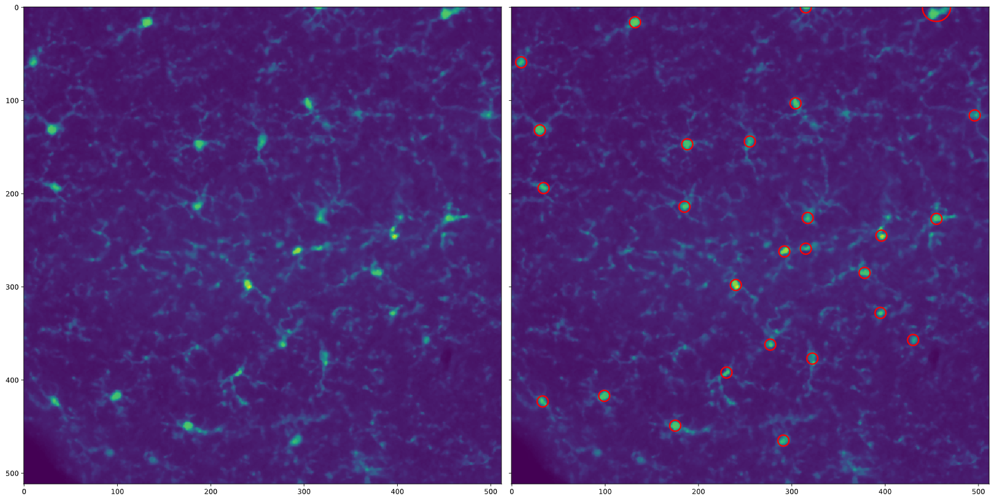

Cell Counting
==============================

Tools to count signal positive cells from IHC images. This is designed for detecting Alexa-488 posititve cells with sparse distribution. However, this should be generalizable to different data sets through use of the training algorithm.

Here you can see a randomly chosen example:

------
## Setup 
### Cloning Repository
With git installed, navigate to the folder you wish to contain this repo and run the following line:

    git clone https://github.com/ixianid/cell_counting/
    
This will copy the repository to your local machine. The repo's organization is based on cookiecutter, with some modifications. See the organization below.

### Project Organization

    ├── LICENSE
    ├── Makefile           <- Makefile with commands like `make data` or `make train`
    ├── README.md          <- The top-level README for developers using this project.
    |
    ├── data               <- This structure is excluded from github repository
    │   ├── external       <- Data from third party sources.
    │   ├── interim        <- Intermediate data that has been transformed.
    │   ├── processed      <- The final, canonical data sets for modeling.
    │   └── raw            <- The original, immutable data dump.
    │
    ├── docs               <- Documentation an further instructions (WIP)
    │
    ├── models             <- Trained and serialized models, model predictions, or model summaries
    │
    ├── notebooks          <- Jupyter notebooks. Naming convention is a number (for ordering),
    │                         the creator's initials, and a short `-` delimited description, e.g.
    │                         `1.0-jqp-initial-data-exploration`.
    │
    ├── references         <- Data dictionaries, manuals, and all other explanatory materials.
    │
    ├── reports            <- Generated analysis as HTML, PDF, LaTeX, etc.
    │   └── figures        <- Generated graphics and figures to be used in reporting
    │
    ├── requirements.txt   <- The requirements file for reproducing the analysis environment, e.g.
    │                         generated with `pip freeze > requirements.txt` for use with virtualenv
    │
    ├── environment.yml    <- The requirements file for producing the usable environment with conda, e.g. 
    |                         generated with 'conda env export > environment.yml
    |
    ├── setup.py           <- makes project pip installable (pip install -e .) so src can be imported
    |
    ├── cc                 <- Source code for use in this project.
    │   ├── __init__.py         <- Makes cc a Python module
    │   │
    │   ├── preprocess          <- Functions for importing and preprocessing raw data (.czi, .tif) 
    │   │   └── make_dataset.py
    │   │
    │   ├── count               <- Module for counting cells
    │   │   └── count_cells.py
    │   │
    │   ├── models              <- Functions to train model for cell counting - brute force WIP
    │   │   └── train_model.py
    │   │
    │   └── plot                <- Functions for plotting and visualizing data
    │       └── plot.py
    │
    └── tox.ini            <- tox file with settings for running tox; see tox.testrun.org

### Setting up virtual environment

Once the repository is cloned, navigate to the head of the repo to set up the virtual environment. 

#### virtualEnv
If you are using virtualenv, run the following line:

    pip install -r requirements.txt

#### conda
If you are using conda, you have two options:

    # Option 1
    conda env create -f environment.yml
    
    # Option 2
    conda create --name <env_name> --file requirements.txt
    
    
## Preprocessing

## Training Model
The current training model is a brute force depth first search for the highest pearson correlation with varying parameters for the Laplacian of Gaussian blob detection algorithm versus manual cell counting. This will be improved, but is functional with time and computing power.

To run the training, manually count ~20 images and record this information in a CSV with unique identifiers for each file. Run the training algorithm:
    
    train_cc(man_counts, imdir, ranges=default_ranges) 

with the CSV (man_counts) and training image directory (imdir) as input. You have the ability to modify the ranges of parameters it will search through to find the highest pearson correlation with the training data. The default range parameters are:

    default_ranges = {
            'min_sigma_low': 1,
            'min_sigma_high': 10,
            'min_sigma_interval':1,
            'max_sigma_low': 20,
            'max_sigma_high': 80,
            'max_sigma_interval': 1,
            'num_sigma_low': 5,
            'num_sigma_high': 40,
            'num_sigma_interval': 1,
            'thresh_low': 0.01,
            'thresh_high': 0.5,
            'thresh_interval': 0.01,
            'overlap_low': 0.01,
            'overlap_high': 0.2,
            'overlap_interval': 0.01
            }    

To choose your own ranges and intervals modify the above dictionary and pass it to 'train_cc'.

After completion, the training algorithm will save a CSV with each pearson correlation and the parameters used for that instance. It will also retrun these parameters as a dictionary Choose the parameters with the highest pearson correlation to proceed. 

## Cell Counting
To count cells make sure 

<small>Project based on the <a target="_blank" href="https://drivendata.github.io/cookiecutter-data-science/">cookiecutter data science project template</a>. #cookiecutterdatascience</small>

"# cell_counting" 
